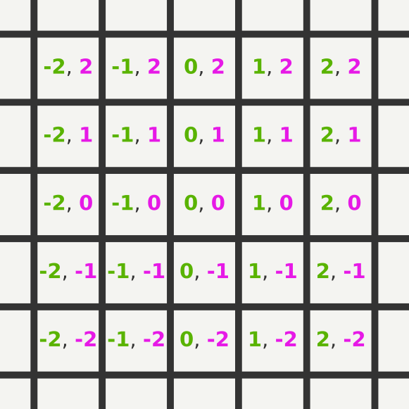
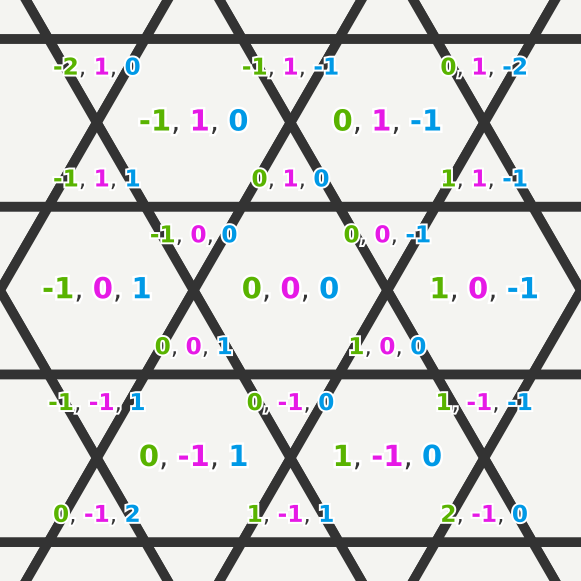

# Grid Co-ordinate Reference Calculations

This repo contains sample code for working with regular hexagon and triangle grids. 

It's been written as clearly and compactly as possible, to serve as a tutorial and reference for how to work with these grids. 
There's many different coordinate systems for working with grids - this guide only covers the systems that are easiest to work with, and convert between. 

## Available Grids

### [square.py](src/square.py)

### [flat_topped_hex.py](src/flat_topped_hex.py)
Reference guide can be found here: https://www.redblobgames.com/grids/hexagons/

### [updown_tri.py](src/updown_tri.py)

### [flat_topped_trihex.py](src/flat_topped_trihex.py)

## Usage

The code here focuses on keeping the methods as readable as possible. You may want to add abstraction on top of them.

The code uses a three-coordinate system for referring to hexes and triangles. This is simplest for working with in memory, but it's not a good format for storage. You can use methods like `hex_rect_index`/`hex_rect_deindex` to convert from co-ordinates to/from a single integer that addresses the cells starting at 0 and counting upwards without gaps, allowing you to store cell values efficiently in a 1d array or file.

Note that some important grid methods, like path finding, are not included. You can find implementations for those in NetworkX.

## Ports

If you port this code to other languages, let me know and I'll keep a list here. You should document what date the porting was done as a simple versioning scheme.
