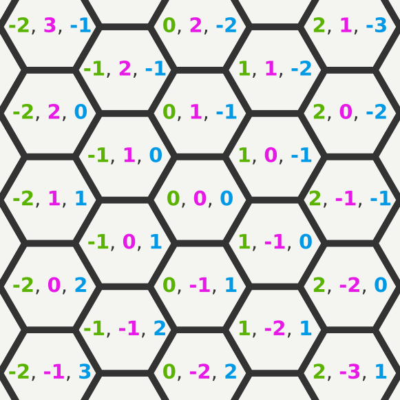
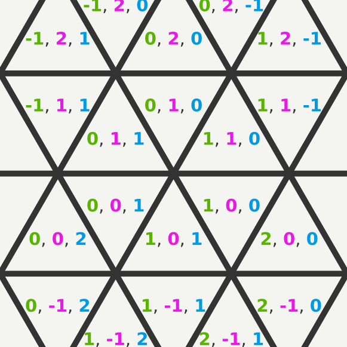

# Grid Co-ordinate Reference Calculations

This repo contains sample code for working with regular hexagon and triangle grids.

It's been written as clearly and compactly as possible, to serve as a tutorial and reference for how to work with these grids. 
There's many different co-ordinate systems for working with grids - this guide only covers the systems that are easiest to work with, and convert between.

## Available Grids

### [flat_topped_hex.py](src/flat_topped_hex.py)

### [updown_tri.py](src/updown_tri.py)

## Ports

If you port this code to other languages, let me know and I'll keep a list here. You should document what date the porting was done as a simple versioning scheme.
